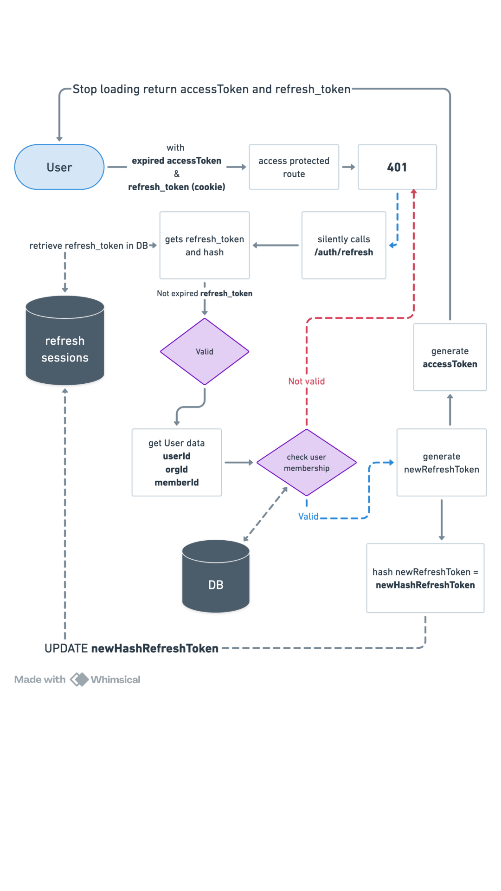

<div align="center">


# TeamBoard

A Trello-lite task board with Organisations/Teams, **JWT authentication**, and a **secure refresh-token workflow**.  
This project is built to demonstrate practical backend patterns around **security, auth flows, and protected APIs**.

<!-- [Live Demo](https://your-demo-link.com) • [API Docs](https://your-docs-link.com) -->

</div>

---

## ✨ Features

### ✅ JWT + Refresh Token Workflow

I implemented a clean refresh-token flow that supports **silent re-authentication** for protected routes (e.g. `/me`) without forcing users to log in again.



#### Advantages

- 🔒 **Short-lived access tokens** reduce the risk of token leakage
- ✅ **Refresh token stored in HttpOnly cookie** (harder to steal via XSS)
- ✅ **Silent refresh** improves UX (auto-renew access token when expired)
- ✅ Clear separation of responsibility: access token = API access, refresh token = session continuation
- ✅ Works well with protected routes + automatic retry on `401 Unauthorized`

#### Current endpoints

REST auth/session endpoints:

- `POST /auth/register`
- `POST /auth/login`
- `POST /auth/refresh`

GraphQL API:

- `POST /graphql`
  I use a single GraphQL endpoint, `POST /graphql`, because GraphQL exposes a schema rather than a separate REST URL for every resource or use case. Check this: [A Practical Hybrid API: REST + GraphQL in Node Microservices](https://antonraphaelcaballes.medium.com/a-practical-hybrid-api-split-rest-graphql-in-node-microservices-trello-like-task-dashboard-684d1e993eaf)

## Fixing Stale Roles in JWTs: “DB-Backed Authorization” for Multi-Tenant APIs

One important improvement in this project is that we do **not rely only on the role stored inside the JWT** for authorization decisions.

For example, a user could be downgraded from `ADMIN` to `MEMBER`, removed from an organization, or switched to a different tenant after the token was issued. If the API trusted the JWT role alone, that user could keep outdated permissions until the token expired.

To avoid that, this project uses a **DB-backed authorization** approach:

- the JWT is still used to authenticate the user identity (`sub`) and active organization (`orgId`)
- on each protected request, the API checks the `memberships` table again
- the current role for that user in that organization is loaded from the database
- authorization decisions are made using the fresh database role, not only the token payload

---

## 🧱 Tech Stack

- Node.js, Express
- PostgreSQL (or MongoDB)
- JWT (access + refresh tokens)

---

## 🚀 Getting Started

### 1) Install

```bash
npm install
```
